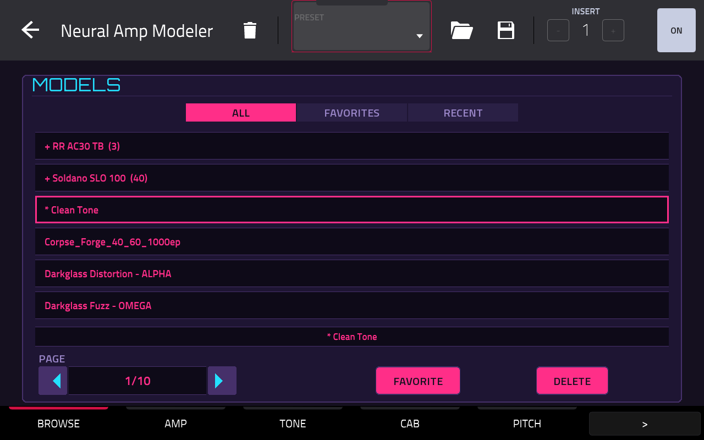
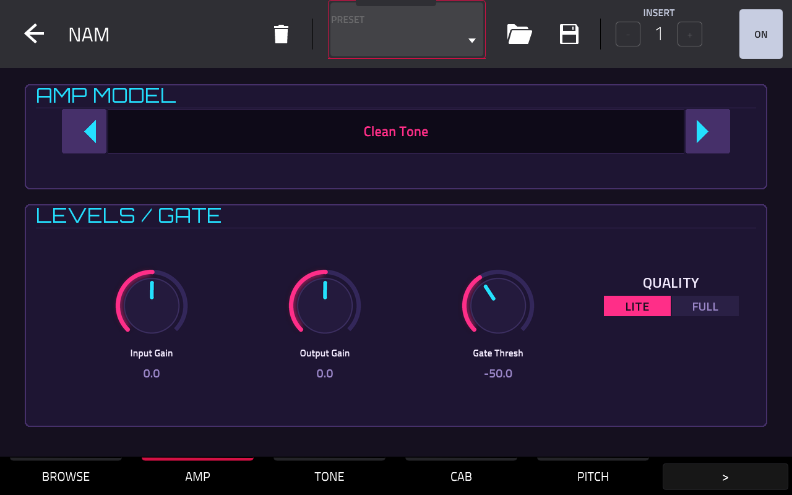
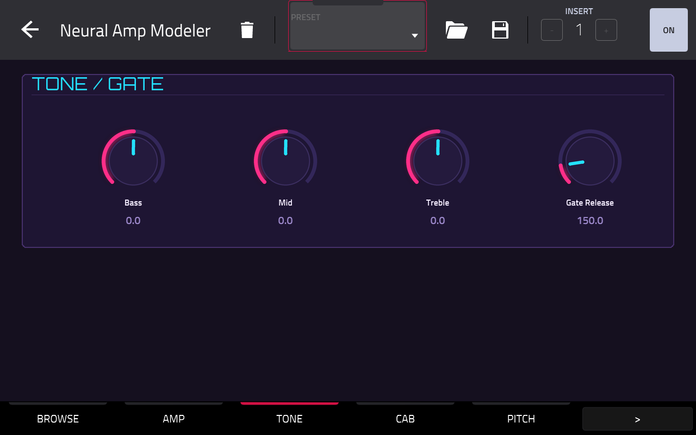
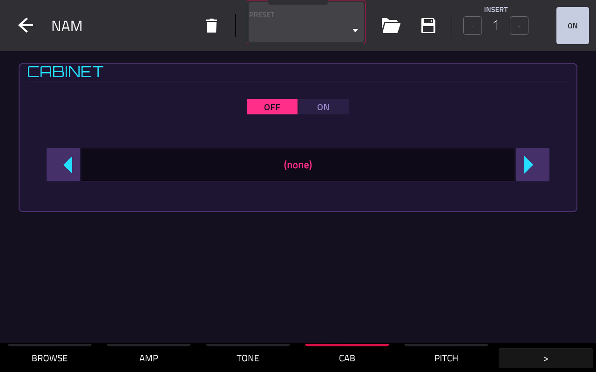
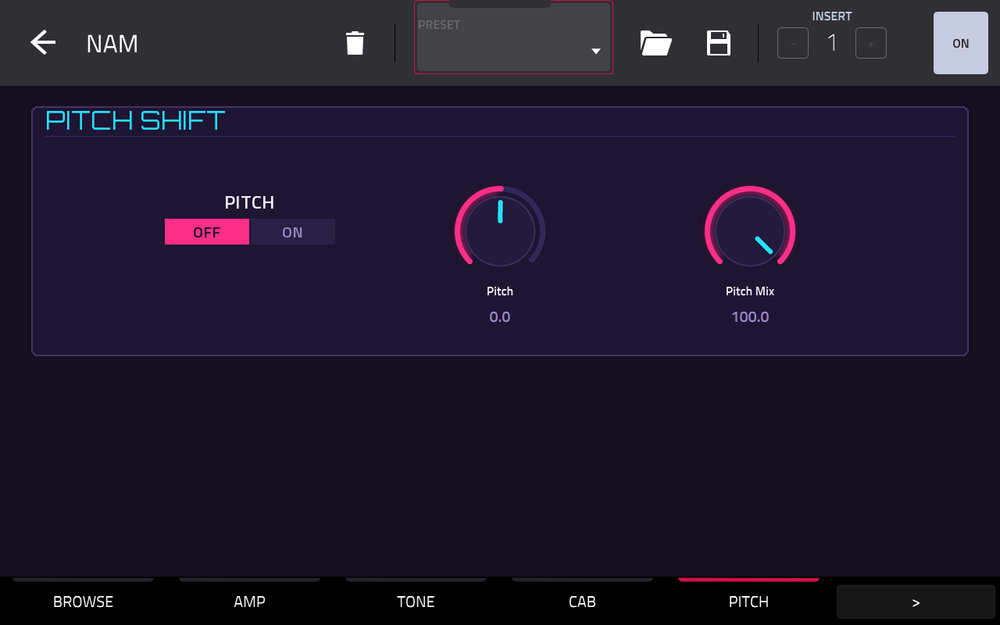
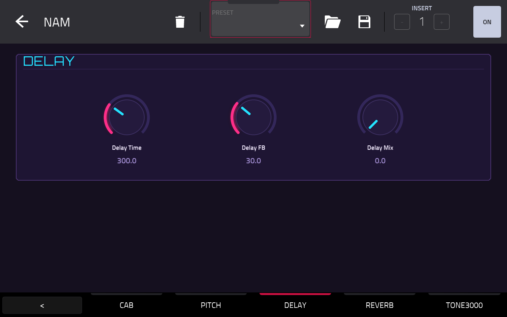
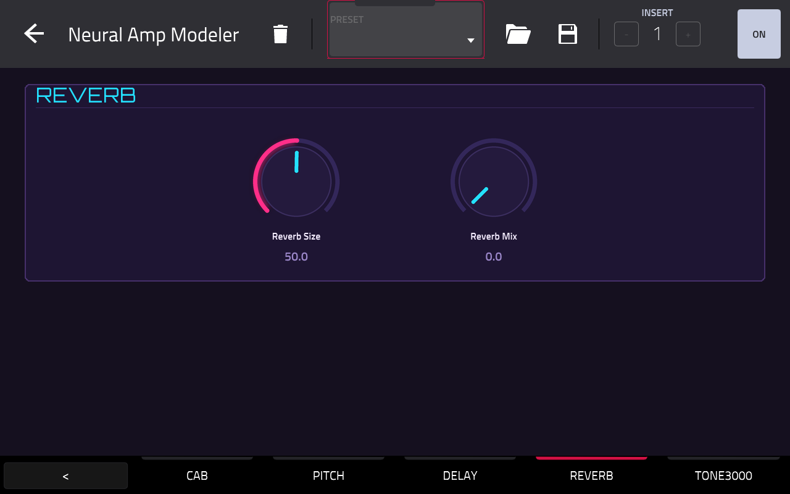
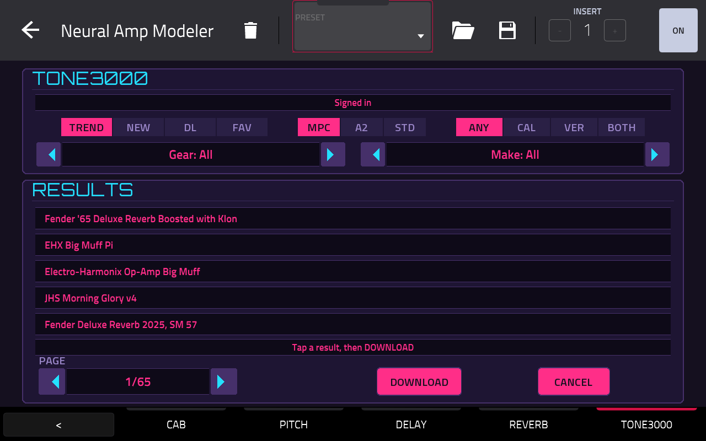

<a id="readme-top"></a>

[![Contributors][contributors-shield]][contributors-url]
[![Forks][forks-shield]][forks-url]
[![Stargazers][stars-shield]][stars-url]
[![Issues][issues-shield]][issues-url]
[![MIT License][license-shield]][license-url]
[](https://github.com/jacob-sabella/mpc-vst-nam/actions/workflows/ci.yml)
[](https://github.com/jacob-sabella/mpc-vst-nam/actions/workflows/build.yml)
[](https://github.com/jacob-sabella/mpc-vst-nam/actions/workflows/secrets.yml)

# NAM (MPC VST Plugin)

**NAM** — a native MPC OS VST2 effect plugin for Akai MPC standalone
devices: run [Neural Amp Modeler](https://github.com/sdatkinson/neural-amp-modeler)
amp and pedal captures as an insert effect, with a cab IR, tone stack,
gate, pitch, delay and reverb behind it, a model browser, and a
[TONE3000](https://www.tone3000.com) tab that downloads new captures
straight onto the device, all on the MPC screen with its own skin and
Q-Links.

Loaded by MPC's own built-in plugin host. There's no companion app and no
separate GUI process: the Tone3000 sign-in page is served by the plugin itself.

## Screenshots

| BROWSE | AMP |
|---|---|
|  |  |
| **TONE** | **CAB** |
|  |  |
| **PITCH** | **DELAY** |
|  |  |
| **REVERB** | **TONE3000** |
|  |  |

## What it is

- **Engine**: [NeuralAmpModelerCore](https://github.com/sdatkinson/NeuralAmpModelerCore)
  (Steven Atkinson, MIT), vendored in `src/`. It runs A2 "slimmable" captures at their
  Lite size by default (`QUALITY` on the AMP tab), which is what makes a
  WaveNet fit on a Cortex-A17 next to MPC. See [CPU](#cpu).
- **Signal path** (mono inside, since one capture is one mono amp): stereo in → mono sum →
  input gain → noise gate → NAM model → tone stack (bass/mid/treble) → cab IR →
  pitch shift → delay → reverb → output gain → both outputs.
- **BROWSE**: every `.nam` under the models folder, with packs shown as
  folders (`+ Pack (N)`). ALL / FAVORITES / RECENT filters, FAVORITE and a
  two-tap DELETE. Delete moves the file to `models-removed/` rather than
  erasing it. New files show up within a second, without reloading the project.
- **TONE3000**: browse Trending / Newest / Most downloaded / your
  favorited tones, pick one and DOWNLOAD. A single capture lands in the
  models folder, and a pack gets its own folder named after the tone.
  Filters narrow the list:
  - **ARCH**: `MPC` (the default: A2 captures at Lite/Feather/Nano size, the ones
    that fit on the CPU, see [CPU](#cpu)), `A2` (every A2 size) or `STD` (the
    site's default, A1 and custom architectures).
  - **QUALITY**: any, calibrated, verified creators, or both.
  - **GEAR**: amp, amp+cab, pedal, cab, outboard, space or experimental.
  - **MAKE**: a list of common amp makers (Fender, Marshall, Mesa Boogie, Vox, …).

  SORT, ARCH, GEAR and MAKE sit on the four Q-Links. The favorites sort
  ignores the filters, since the API doesn't filter that list.
- **PITCH**: a single-reader pitch shifter (±24 semitones) that re-splices
  only when it has to, choosing each splice point by cross-correlation so
  the crossfade stays in phase. Unlike a two-tap shifter it doesn't comb
  filter, so small shifts don't sound metallic. See `vst/pitch_shift.h`.
- **Skin**: a native MPC screen skin (`TUI.json` + Q-Links) built from
  `vst/layout.conf` with [mpc-vst-plugins](https://github.com/sd88me/mpc-vst-plugins)'
  `gen_vst.py`, then `vst/skin_post.py` for the synthwave knob strips.

## How it works

- `vst/nam_vst.cpp` is a hand-written VST2 effect (no Steinberg SDK; the
  AEffect ABI is declared in the file). The framework's generic wrapper is
  synth-only (no audio input), so this follows its `poc/gain.c` effect
  path instead (mpc-vst-plugins `docs/PORTING.md`, category 2).
- Parameters are **append-only**: MPC stores Q-Link and automation mappings by
  index, so `params.json`, the `P_*` enum and `PINFO` in `nam_vst.cpp` must
  stay in the same order. State is saved as a `key=value` chunk. The model
  and cab are saved by name (relative path), so a project still finds its
  model after the library is reorganised.
- MPC never re-polls a parameter's display text on its own. Whenever
  background work changes something on screen (a rescan, a download, a
  status line), the plugin calls `audioMasterUpdateDisplay`.
- `vst/t3k.cpp` is the Tone3000 client: one process-wide worker thread
  plus a tiny HTTP server on port **8090** for the OAuth PKCE sign-in.
  libcurl is `dlopen`'d from the device, so the plugin still loads, and
  only the TONE3000 tab is affected, on a system without it. Nothing
  touches the audio thread.
- Models, cab IRs, favorites and the recycle folder all sit next to the
  `.so`. See `models_dir()` / `cabs_dir()` in `nam_vst.cpp`.

## Requirements

- A first-generation MPC OS standalone device (32-bit ARM). Developed and
  measured on an MPC Key 37 (RK3288). Other Gen1 devices are untested.
- **Root shell access (SSH)** to the device. Stock MPC OS doesn't offer
  this, so you need a modded unit.
- A network connection, for the TONE3000 tab only.
- Installing plugins this way is unofficial. Back up first and use at your
  own risk.

## Build

Requires Docker with armhf emulation (`arm32v7/gcc:12`, `--platform
linux/arm/v7`), plus an [mpc-vst-plugins](https://github.com/sd88me/mpc-vst-plugins)
checkout for the skin:

```sh
./vst/build.sh                          # compile vst/build/nam_vst.so (+ vst/build/bench)
MPC_VST=../mpc-vst-plugins ./vst/gen_skin.sh   # build the MPC skin into vst/build/skin/
```

- Building the NAM core under emulation takes a while. With a local armv7
  hard-float cross toolchain (bootlin `armv7-eabihf--glibc--stable`),
  `ARM_TC=<toolchain dir> ./vst/build.sh` does the same build natively.
- `DOCKER=1 ./vst/gen_skin.sh` runs the skin step in `python:3.11-slim` if
  your python has no Pillow.
- `./vst/build.sh host` builds an x86 copy and runs `vst/host_test.c`
  against it: ABI checks, then audio through the plugin.
- `vst/pitch_test.cpp` compares the pitch shifter offline against a
  two-tap reference (pitch accuracy, amplitude wobble, clicks, latency per shift):
  `g++ -O2 -std=c++17 -Ivst vst/pitch_test.cpp -o vst/build/pitch_test && vst/build/pitch_test`.

CI (`.github/workflows/ci.yml`) runs the host build, `host_test` and
`pitch_test` on every push and pull request. `.github/workflows/build.yml`
builds the armhf `.so` and the skin on every push to `main` and uploads
them as a run artifact. `.github/workflows/secrets.yml` runs
[TruffleHog](https://github.com/trufflesecurity/trufflehog) over the full git
history on every push, pull request and weekly; `scripts/secret-scan.sh` runs
the same scan locally (Docker).

`vst/build.sh` also prints the plugin's exported symbols (only
`VSTPluginMain`), needed shared libs and highest glibc version. Check them
against the target device before shipping.

## Installation

Unzip a release (or build the payload yourself), copy it to the device,
and run its installer:

```sh
scp -r NAM-<version> root@<device-ip>:/tmp/
ssh root@<device-ip> sh /tmp/NAM-<version>/install.sh
```

The installer checks the device architecture and copies the files. It then
**stops MPC** (save your project first), backs up `MPC.settings`, adds the
plugin to MPC's plugin list (`pluginList-arm`), and restarts MPC.

Then add **NAM** (listed under jacob-sabella) as an insert effect. Put `.nam` captures in
`/storage/Synths/NAM/models/` (one folder level of packs is fine), or
download them from the TONE3000 tab.

### Install by hand

1. Copy the files:
   - `vst/build/nam_vst.so` → `/storage/Synths/NAM/nam_vst.so`
   - `vst/build/skin/jacob-sabella - VST - NAM/` →
     `/storage/Synths/jacob-sabella - VST - NAM/`
   - your captures → `/storage/Synths/NAM/models/`, cab IRs (`.wav`) →
     `/storage/Synths/NAM/cabs/`
2. Stop MPC: `systemctl stop acvs`.
3. Back up `/data/Settings/MPC/MPC.settings`.
4. Inside `<VALUE name="pluginList-arm"><KNOWNPLUGINS>`, add the
   `<PLUGIN .../>` line from `vst/build/pluginlist-entry.xml`. If there is no
   `pluginList-arm` value yet, create it just before `</PROPERTIES>`.
5. Start MPC: `systemctl start acvs`. If MPC comes up with default
   settings, restore your backup, because the XML was malformed.

For development, `scripts/deploy.sh <device-ip>` pushes a fresh build and
skin over an existing install, keeping a backup of both, and restarts MPC.

## Tone3000 sign-in

Open the TONE3000 tab. While signed out, it shows
`Sign in on your phone: http://<device-ip>:8090`. Open that address on
a phone on the same network and sign in. The tab flips to "Signed in" by
itself. Tokens are kept in `/storage/nam-tone3000/tokens.json` and
refreshed automatically. Only a rejected refresh signs you out; a
network outage doesn't.

## CPU

Measured on an MPC Key 37 (2× Cortex-A17 @ 1.6 GHz, 44.1 kHz / 128-sample
blocks) with `vst/build/bench`, as % of one core:

| Capture | avg | worst block |
|---|---|---|
| A2 slimmable, **Lite** (default) | 13% | 17% |
| A2 slimmable, Full | ~85% | — |
| A1 standard WaveNet | 100–200% | — |

The pitch shifter adds about 1% of a core when it's on.

The big wins are Lite plus `-DNAM_USE_INLINE_GEMM`: at these channel
counts Eigen's general GEMM setup costs more than the maths. Full quality
and A1 captures don't fit alongside MPC. To measure on the device:

```sh
scp vst/build/bench vst/build/nam_vst.so root@<device-ip>:/tmp/
ssh root@<device-ip> 'NAM_MODELS_DIR=/storage/Synths/NAM/models BENCH_RT=1 /tmp/bench /tmp/nam_vst.so 0 10 128'
```

## Known limitations

- No free-text search: the skin framework has no text-entry widget, so
  the TONE3000 tab browses by sort order plus the filters above, and the
  BROWSE tab by filter/pack. MAKE is a fixed list for the same reason.
- Mono inside. The processed signal is the same on both outputs.
- Cab IRs are truncated to ~93 ms (direct convolution).
- Parameters are append-only (see [How it works](#how-it-works)).
- Developed on a Key 37. Other Gen1 MPC OS devices are untested.

## Credit

- **NAM engine**: [Steven Atkinson](https://github.com/sdatkinson),
  [NeuralAmpModelerCore](https://github.com/sdatkinson/NeuralAmpModelerCore), MIT,
  with [Eigen](https://eigen.tuxfamily.org) (MPL2) and
  [nlohmann/json](https://github.com/nlohmann/json) (MIT). See `src/VENDORED.md`.
- **Plugin framework, skin generator and release tooling**:
  [sd88me/mpc-vst-plugins](https://github.com/sd88me/mpc-vst-plugins).
- **Fonts**: Orbitron and Titillium Web, SIL OFL (`vst/fonts/OFL.txt`).
- **New for this project**: the VST effect and DSP chain around the core
  (`vst/nam_vst.cpp`), the Tone3000 client (`vst/t3k.cpp`), the skin
  layout and knob art, and the build/deploy scripts.

## Releases

Draft releases are built by `.github/workflows/vst-release.yml`, which uses
mpc-vst-plugins' shared release workflow: Actions → "VST release
(draft)" → Run workflow. Install the draft's zip on a device, smoke-test it,
then publish it (see mpc-vst-plugins `docs/RELEASING.md`).

## Vibe Coded

This project was built with [Claude Code](https://claude.ai/code): the
plugin, DSP chain, Tone3000 client, skin layout and the build tooling.

## License

Distributed under the MIT License. See [LICENSE](LICENSE). Vendored code
under `src/` keeps its own licenses (`src/VENDORED.md`), and the fonts
under `vst/fonts/` are SIL OFL 1.1.

Third-party, unsupported project. Not affiliated with or endorsed by
Akai, inMusic, Neural Amp Modeler or TONE3000. Captures you download are
subject to TONE3000's terms and each creator's license.

<p align="right">(<a href="#readme-top">back to top</a>)</p>

[contributors-shield]: https://img.shields.io/github/contributors/jacob-sabella/mpc-vst-nam.svg?style=for-the-badge
[contributors-url]: https://github.com/jacob-sabella/mpc-vst-nam/graphs/contributors
[forks-shield]: https://img.shields.io/github/forks/jacob-sabella/mpc-vst-nam.svg?style=for-the-badge
[forks-url]: https://github.com/jacob-sabella/mpc-vst-nam/network/members
[stars-shield]: https://img.shields.io/github/stars/jacob-sabella/mpc-vst-nam.svg?style=for-the-badge
[stars-url]: https://github.com/jacob-sabella/mpc-vst-nam/stargazers
[issues-shield]: https://img.shields.io/github/issues/jacob-sabella/mpc-vst-nam.svg?style=for-the-badge
[issues-url]: https://github.com/jacob-sabella/mpc-vst-nam/issues
[license-shield]: https://img.shields.io/github/license/jacob-sabella/mpc-vst-nam.svg?style=for-the-badge
[license-url]: https://github.com/jacob-sabella/mpc-vst-nam/blob/main/LICENSE
